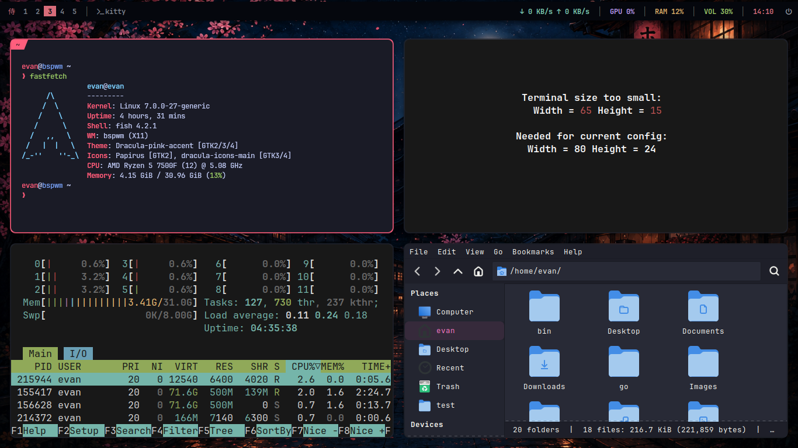

# japan-rice

A Japan-themed [bspwm](https://github.com/baskerville/bspwm) desktop rice — Tokyo Night Dark color palette with pink/blue/purple accents, JetBrainsMono Nerd Font, and Windows-familiar keybindings on top of a tiling window manager.



## Features

- **Window manager:** bspwm, tiling layout, thin pink (`#ff5e7d`) focused borders, blue (`#7aa2f7`) active borders
- **Compositor:** picom (blur, rounded corners, shadows, fading)
- **Bar:** polybar
- **Notifications:** dunst
- **Terminal:** kitty, Tokyo Night Dark color scheme, JetBrainsMono Nerd Font
- **Shell:** fish, custom prompt (`user@bspwm path` + colored `❯` prompt)
- **App launcher / menu:** rofi, single-column list with pink rounded selection highlight
- **System info:** fastfetch, custom kanji logo (生き甲斐 / "ikigai"), trimmed to Kernel / Uptime / Shell / WM / Theme / Icons / CPU / Memory
- **Screenshots:** scrot (PrtScn = full screen, Super+Shift+S = area select)
- **Wallpaper:** static Japanese night-street artwork (`Pictures/bg.png`)
- **Keybindings:** remapped to be Windows-familiar (see [Keybindings](#keybindings) below) while keeping bspwm-specific tiling power-features intact

## Requirements

- Arch/Debian/Ubuntu-family Linux (tested on Ubuntu 26.04) with Xorg
- `bspwm`, `sxhkd`, `polybar`, `picom`, `dunst`, `rofi`, `kitty`, `fastfetch`, `feh`, `fish`, `scrot`, `btop`
- A [Nerd Font](https://www.nerdfonts.com/) — JetBrainsMono Nerd Font is used throughout (terminal, GTK, rofi)

`install.sh` checks for all of the above and offers to install anything missing via `apt`.

## Installation

```sh
cd ~/japan-rice
./install.sh
```

The installer will:

1. Check for missing dependencies and optionally `apt install` them
2. Symlink every tracked config/script from this folder into its real location under `$HOME` (e.g. `japan-rice/.config/kitty/kitty.conf` → `~/.config/kitty/kitty.conf`)
3. Back up anything already at the destination (that isn't already one of these symlinks) into `~/.japan-rice-backup-<timestamp>/`
4. `chmod +x` all scripts

Restart bspwm afterwards (`Ctrl+Shift+R`) or re-login for everything to take effect.

Because files are **symlinked**, editing anything inside `japan-rice/` afterwards immediately updates the live config too.

## Directory structure

```
japan-rice/
├── install.sh                          # installer (symlinks everything below into $HOME)
├── screenshot.png
├── .Xresources
├── Pictures/
│   └── bg.png                          # wallpaper
├── bin/                                 # scripts referenced by sxhkd/bspwm/polybar
│   ├── battery-alert
│   ├── bible
│   ├── brightness
│   ├── calculator
│   ├── change_language.sh
│   ├── cursor_tracker.sh
│   ├── focused_app
│   ├── powermenu
│   ├── random_wallpaper
│   ├── screen-lock
│   ├── show-desktop                    # Super+D "show desktop" toggle
│   ├── timer
│   ├── toggle-polybar
│   ├── volume
│   └── xcolor-pick
└── .config/
    ├── bspwm/
    │   ├── bspwmrc
    │   ├── dual_monitors.sh
    │   ├── dunstrc
    │   └── picom_configurations/1.conf
    ├── sxhkd/
    │   └── sxhkdrc
    ├── polybar/
    │   ├── config.ini
    │   ├── colors.ini
    │   ├── modules.ini
    │   └── launch.sh
    ├── kitty/
    │   └── kitty.conf
    ├── fastfetch/
    │   └── config.jsonc
    ├── fish/
    │   ├── config.fish
    │   ├── conf.d/tokyonight.fish
    │   └── functions/fish_prompt.fish
    ├── rofi/
    │   ├── config.rasi
    │   └── catppuccin.rasi
    └── gtk-3.0/
        └── settings.ini
```

Only files actually referenced by `bspwmrc`, `sxhkdrc`, or `polybar/modules.ini` are tracked here — the full `~/bin` and `~/.config` trees on the source machine contain extra scripts/configs that aren't part of this rice.

## Keybindings

### Windows-familiar shortcuts

| Shortcut | Action |
|---|---|
| `Super + Return` | Open terminal (kitty) |
| `Super + E` | File explorer (Thunar) |
| `Super + D` | Show desktop (hide/restore all windows) |
| `Super + S` | Search / app launcher (rofi) |
| `Super + R` | Run dialog (rofi) |
| `Super + L` | Lock screen |
| `Super + X` | Power / quick-link menu |
| `Super + .` | Emoji picker |
| `Alt + F4` | Close focused window |
| `Ctrl + Shift + Esc` | Task manager (btop) |
| `Print` | Screenshot, full screen |
| `Super + Shift + S` | Screenshot, select area |
| `Super + Arrow keys` | Move focus between windows |
| `Super + Shift + Arrow keys` | Move window in that direction |
| `Super + Ctrl + Arrow keys` | Resize focused window |
| `Alt + Tab` / `Alt + Shift + Tab` | Cycle windows forward / backward |
| `Super + 1-9` | Switch workspace |
| `Super + Shift + 1-9` | Move focused window to workspace |
| `Alt_L + Shift` | Switch keyboard layout |

### App shortcuts

| Shortcut | Action |
|---|---|
| `Super + Shift + F` | Firefox |
| `Super + Shift + P` | Pavucontrol |
| `Super + Shift + T` | Telegram |
| `Super + Shift + C` | Calculator |
| `Super + Shift + V` | VirtualBox |
| `Super + Shift + I` | Firefox private window |
| `Super + Shift + X` | Color picker |
| `Super + Shift + Q` | Bible reader |
| `Super + Shift + K` | Calcurse (calendar) |
| `Super + Shift + Y` | Timer |
| `Super + P` | Toggle polybar |
| `Super + W` | Random wallpaper |
| `XF86Audio*` / `XF86MonBrightness*` | Volume / brightness media keys |

### bspwm tiling-specific (kept — no Windows equivalent)

| Shortcut | Action |
|---|---|
| `Super + T` / `Super + Ctrl + T` / `Super + F` | Tiled / pseudo-tiled / fullscreen state |
| `Super + Space` | Toggle floating |
| `Super + Ctrl + 1-9` | Preselect split ratio |
| `Super + Ctrl + Space` | Cancel node preselection |
| `Super + Ctrl + Shift + Space` | Cancel desktop preselection |
| `Super + Ctrl + M/X/Y/Z` | Toggle marked / locked / sticky / private flag |
| `Super + G` | Swap with biggest window |
| `Super + \`` (grave) | Focus last node/desktop |
| `Ctrl + Shift + Q` / `Ctrl + Shift + R` | Quit / restart bspwm |
| `Super + Ctrl + R` | Reload sxhkd config |

## Theme reference

| Color | Hex | Used for |
|---|---|---|
| Background | `#1a1b26` | Terminal / rofi background |
| Foreground | `#c0caf5` | Default text |
| Pink (accent) | `#ff5e7d` | Focused border, rofi selection, kitty cursor |
| Blue | `#7aa2f7` | Active border, links |
| Purple | `#bb9af7` | Secondary accent |
| Cyan | `#7dcfff` | Tertiary accent |

Font: **JetBrainsMono Nerd Font** (terminal, GTK, rofi). GTK theme: **Dracula-pink-accent**. Icon theme: **Papirus** (with `dracula-icons-main` overrides).

## Notes

- `redshift` was removed from this rice (previously autostarted in `bspwmrc`) — not tracked here.
- `flameshot` was replaced with `scrot` for screenshots.
- The old vim-style (`h/j/k/l`) window navigation keys were replaced with arrow keys as part of the Windows-style remap; the previous `sxhkdrc` is kept at `.config/sxhkd/sxhkdrc.bak-before-windows-remap` for reference/rollback.
